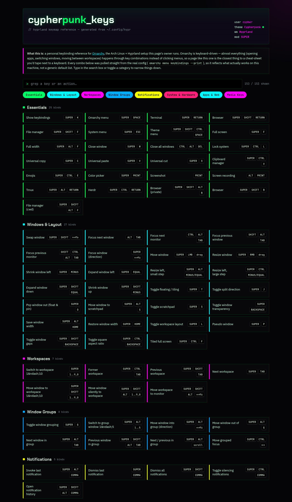
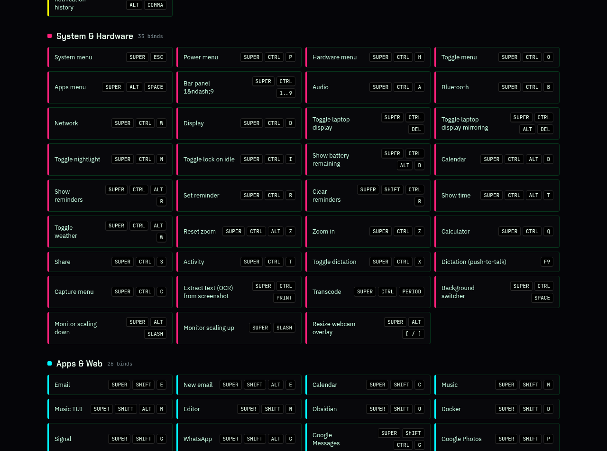

# cypherpunk-keys

A searchable Hyprland keybinding reference for [Omarchy](https://omarchy.org/), styled after the Cypherpunk theme.

Omarchy is keyboard-driven by design — nearly everything (launching apps, managing windows, switching workspaces) happens through key combinations rather than clicking through menus. This page collects every binding from a real, working Omarchy setup into one searchable, filterable list, so it's easy to find "what key does X" without digging through config files.

## Screenshots





## What's in it

- **230+ keybindings**, pulled directly from `omarchy menu keybindings --print`
- Grouped into categories: Essentials, Windows & Layout, Workspaces, Window Groups, Notifications, System & Hardware, Apps & Web, Media Keys
- Live search box and category toggles to narrow the list down
- No build step, no dependencies — a single static `index.html`

## Viewing it

Live at: **https://ak1ra00.github.io/cypherpunk-keys/**

Or just open `index.html` directly in a browser.

## Updating

The bindings are stored as a plain JavaScript array inside `index.html`. To refresh them from a live Omarchy machine:

```bash
omarchy menu keybindings --print
```

Then edit the `DATA` array in `index.html` to match.
